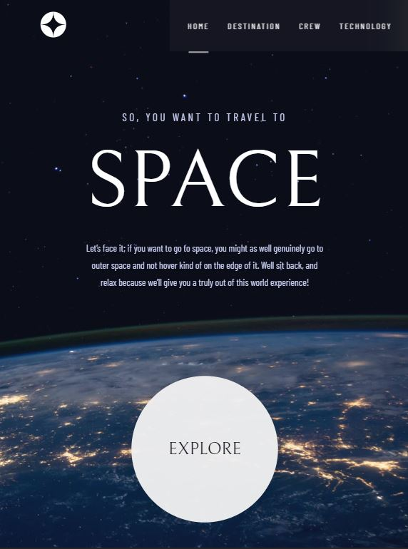

# Frontend Mentor - Space tourism website solution

This is a solution to the [Space tourism website challenge on Frontend Mentor](https://www.frontendmentor.io/challenges/space-tourism-multipage-website-gRWj1URZ3). Frontend Mentor challenges help you improve your coding skills by building realistic projects.

## Table of contents

- [Overview](#overview)
  - [The challenge](#the-challenge)
  - [Screenshot](#screenshot)
  - [Links](#links)
- [My process](#my-process)
  - [Built with](#built-with)
  - [What I learned](#what-i-learned)
- [Author](#author)
- [Acknowledgments](#acknowledgments)

## Overview

Web pages consisting of four pages in which we can navigate between these pages with the help of a router. Transition effects and the usage of sliders in different styles.

### The challenge

Users should be able to:

- View the optimal layout for each of the website's pages depending on their device's screen size
- See hover states for all interactive elements on the page
- View each page and be able to toggle between the tabs to see new information

### Screenshot





You can access screenshots of each page from the 'Screenshots' folder.

### Links

- Solution URL: [Add solution URL here](https://github.com/SertacN/Space-Tourism-Website)
- Live Site URL: [Add live site URL here](https://sertacn.github.io/space-tourism-website/)

## My process

- I have set up the installation of react-router in the project, and arranged the placement of BrowserRouter, Routes, and Route components within it.
- I configured the route logic and determined which components will be rendered when these routes are opened.
- I created the Navbar component that will remain outside of the routes, appear on every page, and be rendered only once.
- I added an additional button to the Home component and set up the route for the button using useNavigate().
- I prepared the content for the Destination, Crew, and Technology pages using the data from the data.json file. I organized the retrieval of data using useState(). As I wanted to create images as sliders, I used the map() method to iterate through the images within the data.
- I wrote className names as template literals and managed the state control within them. I applied animations and class management based on state changes using the ternary operator.
- I added the necessary data for each page at the beginning, then proceeded to make CSS adjustments and completed the functional operations with React.
- I used different state management for tablet and mobile screens. For mobile screens, I replaced the navigation bar with a hamburger menu.

### Built with

- Semantic HTML5 markup
- CSS custom properties
- Flexbox
- esLint
- Mobile-first workflow
- [React](https://reactjs.org/) - JS library
- [Vite.js](https://vitejs.dev/) - React framework
- [React-Router](https://reactrouter.com/en/main) - For route

### What I learned

How to create an infinite loop in CSS and how to handle multiple if statements in JavaScript
How to change inner Text for different device without CSS.

To see how you can add code snippets, see below:

```js
useEffect(() => {
  function handleResize() {
    setIsTablet(window.innerWidth < 769);
  }
  handleResize();
  window.addEventListener("resize", handleResize);
  return () => {
    window.removeEventListener("resize", handleResize);
  };
}, []);
```

```js
<div
  className={`imageContainer ${
    value === 1
      ? "slide-left1"
      : value === 2
      ? "slide-left2"
      : value === 3
      ? "slide-left3"
      : ""
  }`}
></div>
```

```css
.homeBtn button {
  width: 274px;
  height: 274px;
  border-radius: 50%;
  border: none;
  margin-top: 10rem;
  color: #0b0d17;
  box-shadow: rgba(0, 0, 0, 0.16) 0px 0px 64px, rgba(36, 38, 47, 0) 0px 0px 0px 62px;
  transition: 0.3s;
  opacity: 1;
  animation: backdropFilterAnimation 1s infinite alternate;
}
```

## Author

- Website - [SertacN](https://github.com/SertacN)
- Frontend Mentor - [@SertacN](https://www.frontendmentor.io/profile/SertacN)
- Linkedin - [@SertacN](https://www.linkedin.com/in/sertacn/)
